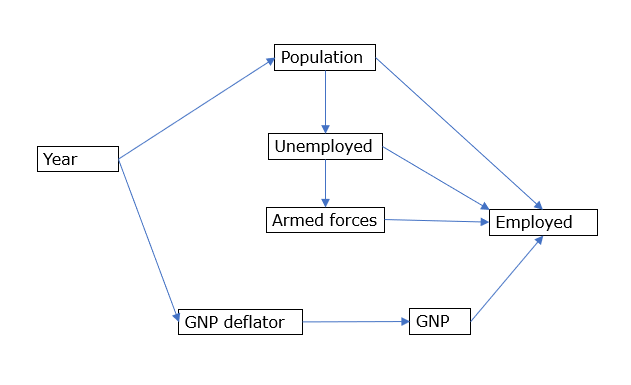
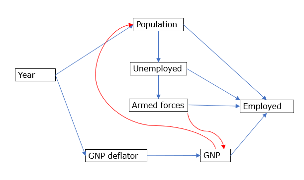

```{r setup, include=FALSE}
knitr::opts_chunk$set(echo = TRUE)
```

## Environmental System Analysis

### Autumn 2021

### Final Report

Exercises in this report use base datasets bundled with R in *`datasets`* package.

### 1. Influence of feed type on the weight of chickens

An experiment was conducted to measure and compare the effectiveness of various feed supplements on the growth rate of chickens. `chickwts` dataset from R *`datasets`* package provides the data from this study.

It has 71 observations on 2 variables; Weight, a numerical variable and feed, a categorical variable.

```{r chickwts summary}
summary(chickwts)
```

#### 1.1 Histogram of the weight of the chicken

```{r Chicken weight histogram}
hist(chickwts$weight, breaks=6, col='salmon')
```

#### 1.2 Testing for normality

```{r Test for Normality}
shapiro.test(chickwts$weight)
```

Shapiro-Wilks test for the wright data gives p-value of 0.21. Because p-value in greater than 0.05, the null hypothesis that the data follows normal distribution, cannot be rejected. Weight data are normally distributed.

#### 1.4 Comparison of means

**Between two types of feeds**

Alternative hypothesis: There is a significant difference in weight between chickens fed with Soybean feed and Sunflower feed.

Null Hypothesis: There is no significant difference in weight.

First, subset the data for Soybean and Sunflower from the original `chickwts` dataset

```{r}
chick2 <- chickwts[chickwts$feed=='soybean' | chickwts$feed=='sunflower', ]
```

Then the data is checked for equal variance.

```{r test for equal variance}
bartlett.test(chick2$weight~chick2$feed)
```

In Bartlett test for equal variance, p-value is 0.72 (\> 0.05). Therefore, weight data show homogeneity of variance between different feed types. Because of this, student-t test is used for comparison of means.

```{r compare means}
t.test(chick2$weight~chick2$feed, var.equal=TRUE)
```

Null hypothesis is rejected.

There is a significant difference in means between chicken fed with soybean feed and sunflower feed.

**Between all six types of feed**

```{r equal variance}
bartlett.test(chickwts$weight~chickwts$feed)
```

In Bartlett test for equal variance, p-value is 0.66 (\> 0.05). Therefore, weight data show homogeneity of variance between different feed types. One-way ANOVA is used for comparison of means.

Null hypothesis: Means of the weights for six types of feed are equal.

```{r}
oneway.test(weight~feed, data = chickwts, var.equal = TRUE )
```

With the extremely small p-value, null hypothesis can be rejected. There is a significant difference between the weight of chicken fed with different types of feed.

### 2. Relationship between hair colour and eye colour

Hair and eye colour and sex of 592 students are recorded the `HairEyeColor` dataset from R *`datasets`* package.

```{r summary}
summary(HairEyeColor)
```

Data are in seperate tables by sexes. They are combined to a single table.

```{r create a single table}
h <- margin.table(HairEyeColor, margin = c(1,2))
h
```

Chi-square test for hair and eye colour

```{r chisquare test}
chisq_h <- chisq.test(h)
chisq_h
```

p-value \< 2.2e-16, therefore there is significant difference between actual and expected distributions.

```{r check chi squared values}
chisq_h$residuals
```

Individual chi-squared residuals show strong associations/disassociations between some hair and eye colours.

There are strong associations between

-   Blond hair and Blue eyes

-   Black hair and Brown eyes

There are strong negative associations between

-   Blond hair and Brown eyes

-   Black hair and Blue eyes

### 3. Relationship between speed of cars and stopping distance

Data is from `cars` dataset. It has two variables, speed (mph) and stopping distance (ft).

```{r summary of data}
summary(cars)
```

**3.1 Scatter plot**

```{r plot the data}
plot(cars$speed, cars$dist)
```

**3.2 Correlation test**

```{r}
cor.test(cars$speed, cars$dist)
```

There is significant correlation between speed and stopping distance of cars.

**3.3 Regression Analysis**

Above data are fitted to a linear model using linear regression.

```{r}
SR <- lm(cars$speed~cars$dist)
summary(SR)
```

### 4. Employment and economic indicators

`Longley` dataset presents 7 variables from 1947 to 1962 that can be used for predicting the number of employed persons in the USA.

A multiple regression model is fitted to this data.

**4.1 Multiple regression analysis**

```{r Longley dataset summary}
summary(longley)
```

```{r Multiple Regression}
#Scaling the data
scl <- scale(longley)
scl_df <- data.frame(scl)
mlr <- lm(Employed~.,data= scl_df)
summary(mlr)
```

Multiple linear regression model is fitted to the data with R^2^ \> 99.5%.

**4.2 Multicolliniarity**

```{r check for multicollinearity}
library(car)
vif(mlr)
cor(scl_df)
```

VIF \> 10 and high correlation (\>0.95) between GNP and GNP-deflator, GNP and Population, GNP and Year, Population and Unemployed, Year and Unemployed, and Population and Year.

Some variables should be removed to reduce the multicolliniarity.

**4.3 Step-wise method**

```{r stepwise method}
library(MASS)
stp_mr <- stepAIC(mlr,direction = 'both')
summary(stp_mr)
```

Best model is selected. Employment is best predicted by GNP, Unemployment, Armed Forces and Year.

**4.4 Principal Component Analysis**

Principal component analysis is used on the same data, to reduce dimentionality.

```{r PCA}
rpca = prcomp(x=longley, scale=T)
summary(rpca)
rpca$x[,1]
rpca$x[,2]
```

**Plot of first two components**

```{r Plotting first two components}
plot(rpca$x[,1],rpca$x[,2])
```

Selection of the number of principal components

```{r pc selection}
cor01 <- cor(longley)
eigen01 <- eigen(cor01)
plot(eigen01$values, type = 'b', main = 'Scree Plot', xlab = 'Number')
abline(h=1, untf = FALSE)
```

Based on the elbow on scree plot and the Kaiser criterion, first two PCs are selected.

**4.5 Factor analysis**

```{r Factor Analysis}
rfa <- factanal(x=longley, factors = 2, rotation = 'promax', scores = 'Bartlett')
rfa
```

All variables are present in Factor 1. Variables that increase annually i.e, GNP,GNP deflator, Population, Year and Employed have the largest values. Only four variables form the factor 2. Unemployment and Armed forces have the largest magnitudes.

Factor Mapping

```{r Factor mapping}
plot(rfa$loadings)
```

4.6 Path Analysis

Relationships described in the following figure in expected to exist among the variables in `longley` dataset.



```{r Path analysis }
shp.model <- 'Employed~Population+Unemployed+Armed.Forces+GNP
GNP~GNP.deflator
GNP.deflator~Year
Population~Year
Unemployed~Population
Armed.Forces~Unemployed'
library(lavaan)
shp.fit <- sem(shp.model, data=longley)
summary(shp.fit, standardized=TRUE, rsquare=TRUE, fit.measures=TRUE)
```

Comparative Fit Index (CFI) is 0.772

Akaike (AIC) is 621.571

RMSEA is 0.648

Modification indices of the model are investigated for further improve the model.

```{r modification of the model}
modificationindices(shp.fit)
```

Two new paths, GNP\~Population and Armed.Forces\~GNP.deflation are added to the model as suggested by the high modification indices.



```{r Path analysis - modified}
shp.model <- 'Employed~Population+Unemployed+Armed.Forces+GNP
GNP~GNP.deflator+Population
GNP.deflator~Year
Population~Year
Unemployed~Population
Armed.Forces~Unemployed+GNP.deflator'
library(lavaan)
shp.fit <- sem(shp.model, data=longley)
summary(shp.fit, standardized=TRUE, rsquare=TRUE, fit.measures=TRUE)
```

Comparative Fit Index (CFI) is 0.843

Akaike (AIC) is 598.411

RMSEA is 0.589

Shown by the increased fit and reduced AIC and RMSEA, the model has been improved by the modifications.
